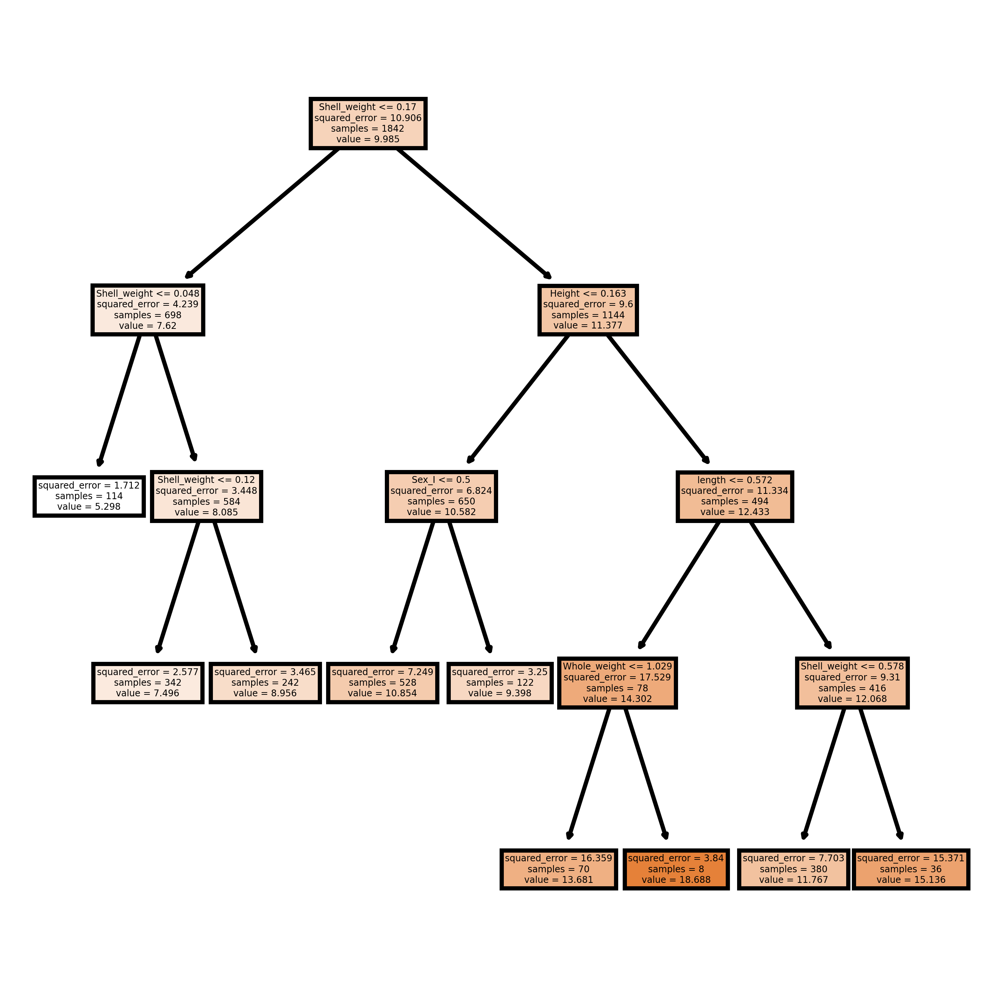

# IA_B1_M2_E2

A01367585 | Fabian Gonzalez Vera

En este repositorio se encuentra, una implementacion del algoritmo de Regresion utilizando Random Forest y el Framework de Machine Learning scikit-learn. El fin del algoritmo es determinar la edad, medida en anillo, de los abalones utilizando sus caracteristicas fisicas.

## Dataset

El data set fue obtenido de la [base de datos](https://archive.ics.uci.edu/dataset/1/abalone) de la universidad de Irving.

Las Variables utilizadas son:
- Sex_I'
- length
- Diameter
- Height
- Whole_weight
- Shell_weight

Variable Objetivo: Rings

Uno de los arboles con conforman el Random Forest:
